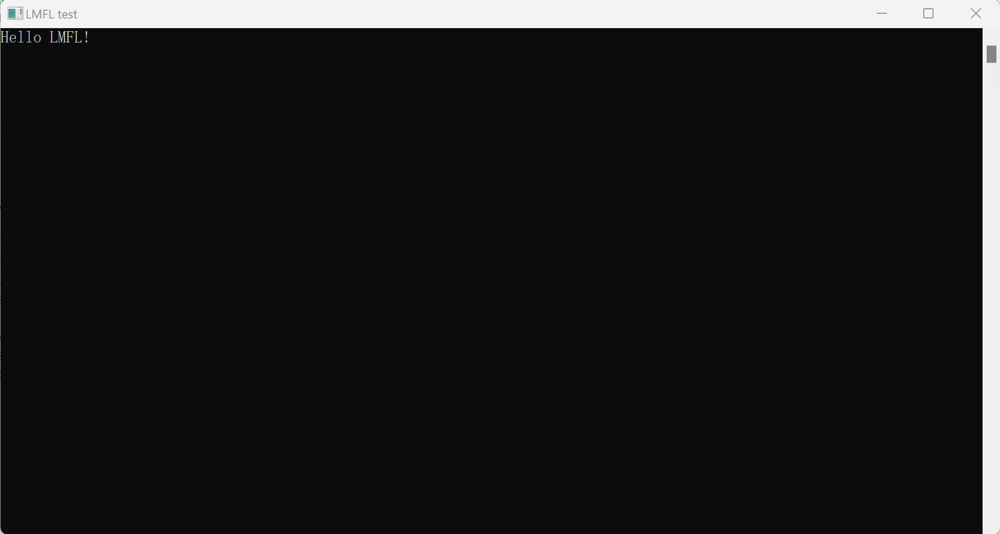

# <font color = "orange">LMFL</font> (Lightweight Multi-Function Library) 1.0.0
## Directory
- [LMFL (Lightweight Multi-Function Library) 1.0.0](#lmfl-lightweight-multi-function-library-100)
  - [Directory](#directory)
  - [Console functions](#console-functions)
    - [notice](#notice)
    - [Example](#example)
      - [code](#code)
      - [compile](#compile)
      - [run](#run)
  - [DATA type](#data-type)
  - [Macros](#macros)
    - [notice](#notice-1)
  - [Example](#example-1)
    - [code](#code-1)
    - [Compile](#compile-1)
    - [Run](#run-1)
## Console functions
**Those functions are used to operate the console when you add -mwindows as a compiler parameter**
* void lmfl.app.console.open()
* void lmfl.app.console.set.title(char*)
* int lmfl.app.console.out( const char* restrict,...)
* int lmfl.app.console.in( const char* restrict,...)
### notice
* **lmfl.app.console.out is used to print on the console;**
* **lmfl.app.console.in is used to get users' type from the console;**
### Example
#### code
```C
/**
** Hello.c - An example of the LMFL console;
** Copyright (c) 2023 JiahaoZeng.
**/

#include "LMFL1.h"

int main(){                                  //enter function
    LMFL                                     //init LMFL
    lmfl.app.console.open();                 //create a console
    lmfl.app.console.set.title("LMFL test"); //set title
    lmfl.app.console.out("Hello LMFL!");     //print
    lmfl.app.loop();                         //main loop
    return 0;
}
```
#### compile
> gcc Hello.c LMFL.dll -o test -mwindows
#### run
> XXX\XXX\XXX>test\

## DATA type
*This type is used to restore any types.*
## Macros
* **LMFL_DATA_IMPORT(resource)**
* **LMFL_DATA_EXPORT(This,resource)**
### notice
* LMFL_DATA_IMPORT will restore "resource" to a DATA type and return the DATA type.
* LMFL_DATA_EXPORT will restore a DATA type to "resource".
* "resource" can't be a const but a var.
## Example
*[example](examples/DATAexample/GetMax.c)*
### code
```C
/**
** GetMax.c - An example of the LMFL DATA type.
** Copyright (c) 2023 JiahaoZeng.
**/

#include "LMFL1.h"

#ifndef GETMAX_FUNC
#define GETMAX_FUNC
typedef unsigned(*get_size_func)(DATA);

DATA get_max( void* array, unsigned type_size, get_size_func size_func, unsigned length){
    typedef BYTE TYPE[type_size];
    TYPE* arr = (TYPE*)array;
    DATA max = LMFL_DATA_IMPORT(arr[0]);

    for( unsigned i = 1; i < length; i++){
        if( size_func( arr[i]) > size_func( max)){
            max = LMFL_DATA_IMPORT(arr[i]);
        }
    }

    return max;
}
#endif /*GETMAX_FUNC*/

#ifndef SONG_TYPE
#define SONG_TYPE
typedef struct{
    char* name;
    unsigned hotness;
}
song;

unsigned get_song_hotness( DATA data){
    song This;
    LMFL_DATA_EXPORT( data, This);
    return This.hotness;
}
#endif /*SONG_TYPE*/

#ifndef SINGER_TYPE
#define SINGER_TYPE
typedef struct{
    char* name;
    unsigned hotness;
}
singer;

unsigned get_singer_hotness( DATA data){
    singer This;
    LMFL_DATA_EXPORT( data, This);
    return This.hotness;
}
#endif /*SINGER_TYPE*/

int main(){
    LMFL;

    // Find the hottest song
    song songs[3];
    songs[0].hotness = 10;
    songs[0].name = "Awaiting on you all";
    songs[1].hotness = 5;
    songs[1].name = "Beware Of Darkness";
    songs[2].hotness = 20;
    songs[2].name = "Run Of The Mill";

    song hottest_song;
    LMFL_DATA_EXPORT( get_max( songs, sizeof(song), get_song_hotness, 3), hottest_song);
    printf( "The hottest song is: 《%s》.\n", hottest_song.name);

    // Find the hottest singer
    singer singers[4];
    singers[0].hotness = 7;
    singers[0].name = "Paul McCartney";
    singers[1].hotness = 2;
    singers[1].name = "Ringo Starr";
    singers[2].hotness = 6;
    singers[2].name = "John Lennon";
    singers[3].hotness = 100;
    singers[3].name = "George Harrison";

    singer hottest_singer;
    LMFL_DATA_EXPORT( get_max( singers, sizeof(singer), get_singer_hotness, 4), hottest_singer);
    printf( "The hottest singer is: %s.\n", hottest_singer.name);

    return 0;
}
```
### Compile
> gcc GetMax.c LMFL.dll -o test
### Run
> XXX\XXX\XXX\>test
```
[LMFL] version 1.0.0, win
The hottest song is: 《Run Of The Mill》.
The hottest singer is: George Harrison.
```